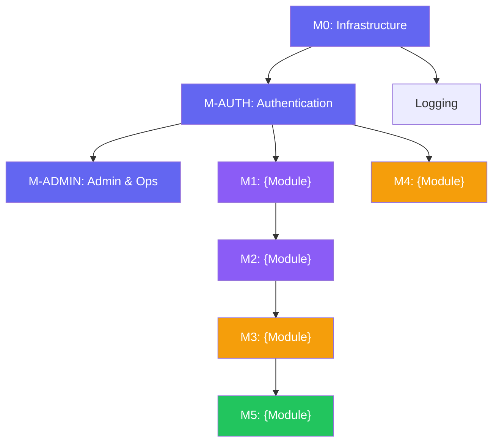

# A3: Module Breakdown — {Project Name}
> **Template Version:** 2.0 | **Created By:** Solution Architect / Project Planner
> **Status:** Draft | **Date:** {YYYY-MM-DD}
> **Depends On:** A1 (Solution Brief), A2 (Solution Architecture)

---

## 1. Module Map

> *The master list of ALL modules in the project. Every module appears here with its metadata. This is the single source of truth for what gets built.*

### 1.1 Standard Modules (Every Project)

> *These are automatically included in every project. Specifications defined in B7 (Admin & Operations Module Standard).*

| # | Module ID | Module Name | Priority | Complexity | Phase | Dependencies |
|---|----------|-------------|----------|-----------|-------|-------------|
| 0 | M0 | Infrastructure & Config | P0 — Must | Low | 1 | None |
| — | M0a | Security Middleware (helmet, rate limit, CORS) | P0 | Low | 1 | M0 |
| — | M0b | Error Handling (centralized handler) | P0 | Low | 1 | M0 |
| — | M0c | Logging Setup (structured JSON, log levels) | P0 | Low | 1 | M0 |
| — | M0d | Health Check Endpoints | P0 | Low | 1 | M0 |
| 1 | M-AUTH | Authentication & RBAC | P0 — Must | Medium | 1 | M0 |
| 2 | M-ADMIN | Admin & Operations Module | P0 — Must | Medium | 1-2 | M-AUTH |
| — | M-ADMIN.1 | Config Management (UI + API) | P0 | Medium | 1 | M-AUTH |
| — | M-ADMIN.2 | Log Viewer (App + Server logs) | P1 | Medium | 2 | M-AUTH, M0c |
| — | M-ADMIN.3 | Health Dashboard | P1 | Low | 2 | M0d |
| — | M-ADMIN.4 | User Management | P0 | Medium | 1 | M-AUTH |
| — | M-ADMIN.5 | Audit Trail | P1 | Low | 2 | M-AUTH |

### 1.2 Project-Specific Modules

| # | Module ID | Module Name | Priority | Complexity | Phase | Dependencies |
|---|----------|-------------|----------|-----------|-------|-------------|
| 3 | M1 | {e.g. Candidate Profiles} | P0 — Must | {Medium} | {1} | M-AUTH |
| 4 | M2 | {e.g. Job Management} | P0 — Must | {Medium} | {2} | M1 |
| 5 | M3 | {e.g. Applications} | P0 — Must | {High} | {2} | M1, M2 |
| 6 | M4 | {e.g. Notifications} | P1 — Should | {Medium} | {2} | M-AUTH |
| 7 | M5 | {e.g. Reports} | P1 — Should | {Medium} | {3} | M1, M2, M3 |
| 8 | M6 | {e.g. i18n} | P2 — Nice | {Low} | {3} | All UI modules |

> **Priority Key:** P0 = Must Have (core) | P1 = Should Have (expected) | P2 = Nice to Have (delight)

---

## 2. Dependency Graph



> **Colors:** 🟣 Purple = P0 Must | 🟡 Yellow = P1 Should | 🟢 Green = P2 Nice

---

## 3. Module Detail Template

> *Repeat this section for every project-specific module (M1, M2, M3...). Standard modules (M0, M-AUTH, M-ADMIN) are defined in B7 and don't need detail here unless customized.*

---

### {Module ID}: {Module Name}

| Field | Value |
|-------|-------|
| **Priority** | {P0 / P1 / P2} |
| **Phase** | {1 / 2 / 3} |
| **Complexity** | {Low / Medium / High} |
| **Estimated Effort** | {X days} |
| **Dependencies** | {M-AUTH, M1, ...} |
| **FRS/SRS Reference** | {§X.X — source requirement} |

#### Database Tables
| Table | Purpose | Key Columns |
|-------|---------|-------------|
| `{table_name}` | {What it stores} | {id, field1, field2, foreign_keys} |

#### API Endpoints
| Method | Endpoint | Purpose | Auth | Roles |
|--------|----------|---------|------|-------|
| POST | `/api/v1/{resource}` | {Create} | Yes | {admin, agent} |
| GET | `/api/v1/{resource}` | {List with filters} | Yes | {All authenticated} |
| GET | `/api/v1/{resource}/:id` | {Get by ID} | Yes | {Owner, admin} |
| PATCH | `/api/v1/{resource}/:id` | {Update} | Yes | {Owner, admin} |
| DELETE | `/api/v1/{resource}/:id` | {Delete/archive} | Yes | {Admin only} |

#### UI Components
| Component | Type | Route | Description |
|-----------|------|-------|------------|
| {ComponentName} | {Page / Modal / Form / Widget} | {/route} | {What it displays/does} |

#### File Structure
```
server/
├── routes/{module}.routes.ts
├── services/{module}.service.ts
└── middleware/{module-specific if needed}
client/
├── src/pages/{ModulePage}.tsx
├── src/components/{module}/
│   ├── {Component1}.tsx
│   └── {Component2}.tsx
```

#### Acceptance Criteria
- [ ] {Criterion 1: e.g. CRUD operations work with validation}
- [ ] {Criterion 2: e.g. Only authorized roles can access}
- [ ] {Criterion 3: e.g. Pagination returns < 500ms}
- [ ] {Criterion 4: e.g. UI connected to real API (no mock data)}

---

### {Next Module}: {Name}

> *Repeat section 3 template for each project-specific module.*

---

## 4. Cross-Module Concerns

> *Patterns and infrastructure shared across all modules.*

| Concern | Approach | Implemented In |
|---------|---------|---------------|
| **Error Handling** | Centralized error middleware — consistent JSON responses | M0 (errorHandler.middleware) |
| **Input Validation** | Zod schemas validated via middleware | M0 (validate.middleware) + shared/validators |
| **Logging** | Structured JSON via Winston/Pino — configurable level | M0 (logger.config) + B7 (log level control) |
| **Authentication** | Session-based with Passport.js | M-AUTH |
| **Authorization** | RBAC middleware checking `req.user.role` | M-AUTH (rbac.middleware) |
| **Rate Limiting** | Redis-backed shared limiter | M0 (rateLimit.middleware) |
| **File Uploads** | Multer middleware, type/size validation | Per-module as needed |
| **Pagination** | Standard `?page=1&limit=20` with metadata response | Shared utility |
| **Audit Trail** | All admin/destructive actions logged | M-ADMIN (audit.middleware) |

---

## 5. Effort Summary

| Phase | Modules | Total Effort (days) | Estimated Duration |
|-------|---------|--------------------|--------------------|
| 1 | M0, M-AUTH, M-ADMIN.1, M-ADMIN.4, M1 | {X} | {Sprint 1-2} |
| 2 | M-ADMIN.2, M-ADMIN.3, M-ADMIN.5, M2, M3, M4 | {X} | {Sprint 3-4} |
| 3 | M5, M6 | {X} | {Sprint 5} |
| **Total** | **{N} modules** | **{X days}** | **{X sprints}** |

> **Risk Buffer:** Add {15-25%} to raw estimates for integration complexity, testing, and unknowns.

---

## 6. Module Status Tracker

> *Update this as development progresses.*

| Module | Backend | Frontend | Tests | Integration | Status |
|--------|---------|----------|-------|-------------|--------|
| M0 Infrastructure | ☐ | N/A | ☐ | ☐ | Not Started |
| M-AUTH | ☐ | ☐ | ☐ | ☐ | Not Started |
| M-ADMIN | ☐ | ☐ | ☐ | ☐ | Not Started |
| M1 {name} | ☐ | ☐ | ☐ | ☐ | Not Started |
| M2 {name} | ☐ | ☐ | ☐ | ☐ | Not Started |

---

## 7. Revision History

| Version | Date | Author | Changes |
|---------|------|--------|---------|
| 1.0 | {YYYY-MM-DD} | | Initial module breakdown |

---

> *This document is the MASTER MODULE LIST. Every module built in the project must be listed here. A5 (Phase PRD) references modules from this list — it does not re-define them. A4 (Dev Plan) sequences them into phases using this list as input.*
