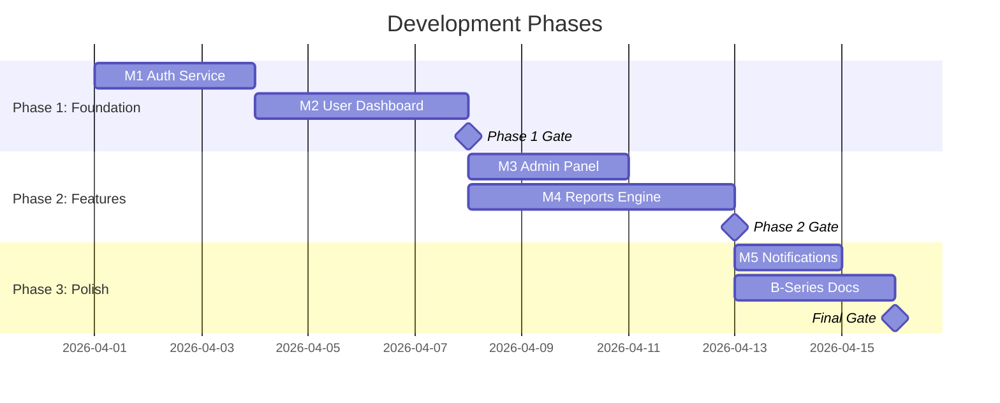

# A4: Development Plan & Phasing — {Project Name}
> **Template Version:** 1.0 | **Created By:** Sisko (Project Planner)
> **Status:** Draft | **Date:** {YYYY-MM-DD}
> **Depends On:** A3 (Module Breakdown)

---

## 1. Phase Overview

| Phase | Name | Modules | Duration | Quality Gate | Status |
|-------|------|---------|----------|-------------|--------|
| 1 | Foundation | M1, M2 | Sprint 1-2 | Unit tests 100%, API live | ☐ |
| 2 | Features | M3, M4 | Sprint 3-4 | Integration tests, review | ☐ |
| 3 | Polish & Ship | M5 + B-series | Sprint 5 | Full suite, docs, package | ☐ |



---

## 2. Phase 1: Foundation

### Sprint 1.1 — {Module M1}

| Step | Agent | Task | Output | Gate |
|------|-------|------|--------|------|
| 1 | Jane | Triage M1 into task spec | JSON spec | — |
| 2 | Spock | Research best patterns for {module} | Research dossier | — |
| 3 | Torres | Build {module} source code | `/src/{module}/` | — |
| 3b | Tuvok | Build tests IN PARALLEL with Torres | `/tests/{module}/` | — |
| 4 | Data | Architecture review of code + tests | APPROVED/NEEDS_FIX | ☐ |
| 5 | Tuvok | Run full test suite | All pass | ☐ |
| 6 | O'Brien | Git commit, tag Sprint 1.1 | Committed | ☐ |

**Gate Criteria:**
- [ ] All unit tests pass
- [ ] All endpoints respond correctly
- [ ] Code review approved by Data
- [ ] No security flags from Tuvok

### Sprint 1.2 — {Module M2}

| Step | Agent | Task | Output | Gate |
|------|-------|------|--------|------|
| 1 | Jane | Triage M2 into task spec | JSON spec | — |
| 2 | Spock | Research best patterns | Research dossier | — |
| 3 | Torres | Build {module} source code | `/src/{module}/` | — |
| 3b | Tuvok | Build tests IN PARALLEL | `/tests/{module}/` | — |
| 4 | Data | Architecture review | APPROVED/NEEDS_FIX | ☐ |
| 5 | Tuvok | Run full test suite (M1 + M2) | All pass | ☐ |
| 6 | O'Brien | Git commit, tag Sprint 1.2 | Committed | ☐ |

**Phase 1 Gate:**
- [ ] M1 + M2 complete and tested
- [ ] Integration test between M1 ↔ M2 passes
- [ ] Human review checkpoint (optional)
- [ ] Ready for Phase 2

---

## 3. Phase 2: Features

### Sprint 2.1 — {Module M3}

| Step | Agent | Task | Output | Gate |
|------|-------|------|--------|------|
| 1-6 | {Same pipeline as above} | | | |

### Sprint 2.2 — {Module M4}

| Step | Agent | Task | Output | Gate |
|------|-------|------|--------|------|
| 1-6 | {Same pipeline as above} | | | |

**Phase 2 Gate:**
- [ ] M3 + M4 complete and tested
- [ ] Full integration test suite (M1-M4) passes
- [ ] Performance benchmarks met
- [ ] Human review checkpoint

---

## 4. Phase 3: Polish & Ship

### Sprint 3.1 — Remaining Modules + Enhancements

| Step | Agent | Task | Output |
|------|-------|------|--------|
| 1 | Torres | Build M5 + Troi's quick wins | Source code |
| 2 | Tuvok | Complete test suite | Full coverage |
| 3 | Crusher | Generate B1-B5 documentation | `/docs/` |
| 4 | Troi | Finalize B4 + B6 reports | AI enhancements + 110% |
| 5 | O'Brien | Generate Dockerfile, package.json | Deployment ready |
| 6 | O'Brien | Create delivery .zip | 📦 Package |
| 7 | O'Brien | Generate B7 Factory Report | `.factory-report.json` |

**Final Gate:**
- [ ] All modules complete (M1-M5)
- [ ] Full test suite passes (unit + integration + security)
- [ ] All 13 PMD documents generated
- [ ] Delivery .zip package created
- [ ] Human final review + sign-off

---

## 5. Self-Healing Protocol

When ANY gate fails:

```
Gate FAIL detected
      │
      ▼
Iteration count < 3?
      │
   Yes ├──→ Pass error context to Torres
      │     Torres rewrites the failing code
      │     Tuvok re-runs tests
      │     Data re-reviews
      │     → Attempt gate again
      │
   No  ├──→ 🚨 FLAG TO HUMAN
            Log the failure in B7 Factory Report
            Pause pipeline, await human intervention
```

---

## 6. Resource Allocation

| Agent | Phase 1 Load | Phase 2 Load | Phase 3 Load |
|-------|-------------|-------------|-------------|
| Jane | Active | Active | Light |
| Spock | Active | Active | Light |
| Torres | **Heavy** | **Heavy** | Medium |
| Data | Medium | Medium | Light |
| Tuvok | **Heavy** | **Heavy** | **Heavy** |
| O'Brien | Light | Light | **Heavy** |
| Crusher | — | — | **Heavy** |
| Troi | Light (B6) | — | Medium |

---

## 7. Risk & Mitigation

| Risk | Phase | Impact | Mitigation |
|------|-------|--------|-----------|
| {Model API rate limits} | All | {Delays} | {Queue requests, retry logic} |
| {Complex module exceeds capacity} | 2 | {Poor code quality} | {Break into sub-modules} |
| {Test failures in self-heal loop} | Any | {Pipeline stall} | {Max 3 retries → human flag} |

---

> *This plan is executed phase-by-phase. Each phase must pass its gate before the next begins.*
