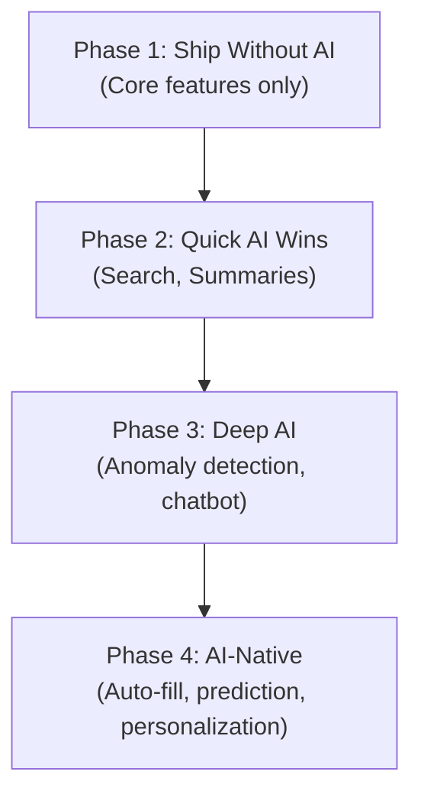

# B4: AI Enhancement Report — {Project Name}
> **Template Version:** 1.1 | **Created By:** Solution Architect / Enhancement Analyst
> **Purpose:** Identify where AI/ML can add transformative value specific to THIS project.
> **Status:** ⚠️ CONDITIONAL — Include ONLY if the project qualifies (see criteria below).

---

## 0. Inclusion Criteria

> *Apply B4 ONLY if the project answers YES to at least one:*

| # | Question | Answer |
|---|---------|--------|
| 1 | Does the app handle **searchable content** (documents, records, listings)? | {Yes/No} |
| 2 | Does the app involve **user-facing data** that could benefit from recommendations? | {Yes/No} |
| 3 | Does the app require **data extraction** from documents (PDF, images)? | {Yes/No} |
| 4 | Does the app produce **reports or summaries** that humans currently write? | {Yes/No} |
| 5 | Does the app have **decision-making workflows** that could use scoring/ranking? | {Yes/No} |

> If ALL answers are NO → Skip B4. Document as "B4: Not applicable — no AI opportunities identified."

---

## 1. Executive Summary

{One paragraph: After analyzing the project modules and user workflows, here are the top AI opportunities that could elevate this application from a standard tool to an intelligent platform.}

---

## 2. AI Opportunity Assessment

| # | Feature Area | AI Enhancement | Feasibility | Customer Impact | Effort | Recommended? |
|---|-------------|---------------|-------------|----------------|--------|-------------|
| 1 | {Search} | {Semantic search using vector embeddings instead of keyword} | Easy | 🔴 Transformative | {2 days} | ✅ Yes |
| 2 | {Dashboard} | {Anomaly detection — auto-flag unusual metrics} | Medium | 🟡 High | {3 days} | ✅ Yes |
| 3 | {Reports} | {AI-generated summaries with natural language insights} | Easy | 🟡 High | {1 day} | ✅ Yes |
| 4 | {Onboarding} | {AI chatbot explaining features in natural language} | Medium | 🟢 Medium | {4 days} | ⚠️ Phase 2 |
| 5 | {Data Entry} | {Auto-fill and suggestion from historical data} | Hard | 🟡 High | {5 days} | ❌ Future |

**Impact Scale:** 🔴 Transformative → 🟡 High → 🟢 Medium → ⚪ Low

---

## 3. Detailed Analysis per Opportunity

### Opportunity 1: {AI Enhancement Name}

| Field | Detail |
|-------|--------|
| **Feature Area** | {Which feature/module this enhances} |
| **Current State** | {How it works today without AI} |
| **AI-Enhanced State** | {How it would work WITH AI} |
| **User Benefit** | {Concrete benefit — saves time, finds insights, prevents errors} |
| **Technical Approach** | {Which model/API — Gemini, OpenAI, local LLM, vector DB} |
| **Data Required** | {What data does the AI need to function?} |
| **Privacy Implications** | {Does user data leave the system? PII concerns?} |
| **Estimated Effort** | {X agent-cycles / Y days} |
| **Dependencies** | {API key, additional infrastructure, training data} |

**Implementation Sketch:**
```
{Pseudo-code or architecture snippet showing how the AI integrates}

Example:
1. User types search query
2. Backend sends query to embedding API
3. Vector similarity search against document embeddings
4. Return top-K results ranked by relevance
5. Optionally: generate a natural language summary of results
```

---

### Opportunity 2: {Next Enhancement}
> *Repeat structure as above*

---

## 4. Recommended AI Stack

| Purpose | Recommended Tool | Cost | Hosting |
|---------|-----------------|------|---------|
| Text Generation | {Gemini 2.5 Flash} | {Low} | {API call} |
| Embeddings | {text-embedding-004} | {Very low} | {API call} |
| Vector Storage | {ChromaDB} | {Free} | {Self-hosted} |
| Image Analysis | {Gemini 3.1 Pro Vision} | {Medium} | {API call} |
| Classification | {Fine-tuned model / prompt-based} | {Varies} | {Depends} |

---

## 5. ROI Analysis

| AI Enhancement | Dev Cost | Monthly Running Cost | Value Generated | ROI |
|---------------|---------|---------------------|----------------|-----|
| {Semantic Search} | {2 days} | {$5/month API} | {Saves 10 min/user/day} | {High} |
| {Auto-Summaries} | {1 day} | {$3/month API} | {Saves 30 min/report} | {Very High} |
| {Anomaly Detection} | {3 days} | {$0 (rule-based)} | {Prevents missed issues} | {High} |

---

## 6. Implementation Priority



---

> *Troi identifies these opportunities. The customer decides which to approve.
> Quick wins in Phase 1 are automatically included as part of the 110% standard.*
